Drug Use Analysis
================
Danish Siddiquie, Drake Horton
October 1, 2017

``` r
library(dplyr)
```

    ## 
    ## Attaching package: 'dplyr'

    ## The following objects are masked from 'package:stats':
    ## 
    ##     filter, lag

    ## The following objects are masked from 'package:base':
    ## 
    ##     intersect, setdiff, setequal, union

``` r
library(ggplot2)
library(Hmisc)
```

    ## Loading required package: lattice

    ## Loading required package: survival

    ## Loading required package: Formula

    ## 
    ## Attaching package: 'Hmisc'

    ## The following objects are masked from 'package:dplyr':
    ## 
    ##     src, summarize

    ## The following objects are masked from 'package:base':
    ## 
    ##     format.pval, units

``` r
library(readr)
drugs2014 <- read_csv("smalldrugs2014.csv", col_names = TRUE)
```

    ## Parsed with column specification:
    ## cols(
    ##   .default = col_integer(),
    ##   IRALCFM = col_double()
    ## )

    ## See spec(...) for full column specifications.

``` r
drugs2005 <- read_csv("smalldrugs2005.csv", col_names = TRUE)
```

    ## Parsed with column specification:
    ## cols(
    ##   .default = col_integer(),
    ##   IRALCFM = col_double()
    ## )
    ## See spec(...) for full column specifications.

``` r
summary(drugs2005)
summary(drugs2014)
sub2014 <- drugs2014 %>%
  select(COCYR, HERYR, OXYYR, MTHYR, CATAG7, IRSEX, INCOME, EDUCCAT2) %>%
  mutate(year = 2014)
summary(drugs2005)
sub2005 <- drugs2005 %>%
  select(COCYR, HERYR, OXYYR, MTHYR, CATAG7, IRSEX, INCOME, EDUCCAT2) %>%
  mutate(year = 2005)
sub05_14 <- rbind(sub2005, sub2014)
```

``` r
drugs2006 <- read_csv("smalldrugs2006.csv", col_names = TRUE)
```

    ## Parsed with column specification:
    ## cols(
    ##   .default = col_integer(),
    ##   IRALCFM = col_double()
    ## )

    ## See spec(...) for full column specifications.

``` r
sub2006 <- drugs2006 %>%
  select(COCYR, HERYR, OXYYR, MTHYR, CATAG7, IRSEX, INCOME, EDUCCAT2) %>%
  mutate(year = 2006)
drugs2007 <- read_csv("smalldrugs2007.csv", col_names = TRUE)
```

    ## Parsed with column specification:
    ## cols(
    ##   .default = col_integer(),
    ##   IRALCFM = col_double()
    ## )
    ## See spec(...) for full column specifications.

``` r
sub2007 <- drugs2007 %>%
  select(COCYR, HERYR, OXYYR, MTHYR, CATAG7, IRSEX, INCOME, EDUCCAT2) %>%
  mutate(year = 2007)
drugs2008 <- read_csv("smalldrugs2008.csv", col_names = TRUE)
```

    ## Parsed with column specification:
    ## cols(
    ##   .default = col_integer(),
    ##   IRALCFM = col_double()
    ## )
    ## See spec(...) for full column specifications.

``` r
sub2008 <- drugs2008 %>%
  select(COCYR, HERYR, OXYYR, MTHYR, CATAG7, IRSEX, INCOME, EDUCCAT2) %>%
  mutate(year = 2008)
drugs2009 <- read_csv("smalldrugs2009.csv", col_names = TRUE)
```

    ## Parsed with column specification:
    ## cols(
    ##   .default = col_integer(),
    ##   IRALCFM = col_double()
    ## )
    ## See spec(...) for full column specifications.

``` r
sub2009 <- drugs2009 %>%
  select(COCYR, HERYR, OXYYR, MTHYR, CATAG7, IRSEX, INCOME, EDUCCAT2) %>%
  mutate(year = 2009)
drugs2010 <- read_csv("smalldrugs2010.csv", col_names = TRUE)
```

    ## Parsed with column specification:
    ## cols(
    ##   .default = col_integer(),
    ##   IRALCFM = col_double()
    ## )
    ## See spec(...) for full column specifications.

``` r
sub2010 <- drugs2010 %>%
  select(COCYR, HERYR, OXYYR, MTHYR, CATAG7, IRSEX, INCOME, EDUCCAT2) %>%
  mutate(year = 2010)
drugs2011 <- read_csv("smalldrugs2011.csv", col_names = TRUE)
```

    ## Parsed with column specification:
    ## cols(
    ##   .default = col_integer()
    ## )
    ## See spec(...) for full column specifications.

    ## Warning in rbind(names(probs), probs_f): number of columns of result is not
    ## a multiple of vector length (arg 1)

    ## Warning: 86 parsing failures.
    ## row # A tibble: 5 x 5 col     row col     expected               actual file                 expected   <int> <chr>   <chr>                  <chr>  <chr>                actual 1  1126 IRALCFM no trailing characters .5     'smalldrugs2011.csv' file 2  1644 IRALCFM no trailing characters .5     'smalldrugs2011.csv' row 3  2036 IRALCFM no trailing characters .5     'smalldrugs2011.csv' col 4  5621 IRALCFM no trailing characters .5     'smalldrugs2011.csv' expected 5  6280 IRALCFM no trailing characters .5     'smalldrugs2011.csv'
    ## ... ................. ... .................................................................. ........ .................................................................. ...... .................................................................. .... .................................................................. ... .................................................................. ... .................................................................. ........ ..................................................................
    ## See problems(...) for more details.

``` r
sub2011 <- drugs2011 %>%
  select(COCYR, HERYR, OXYYR, MTHYR, CATAG7, IRSEX, INCOME, EDUCCAT2) %>%
  mutate(year = 2011)
drugs2012 <- read_csv("smalldrugs2012.csv", col_names = TRUE)
```

    ## Parsed with column specification:
    ## cols(
    ##   .default = col_integer(),
    ##   IRALCFM = col_double()
    ## )
    ## See spec(...) for full column specifications.

``` r
sub2012 <- drugs2012 %>%
  select(COCYR, HERYR, OXYYR, MTHYR, CATAG7, IRSEX, INCOME, EDUCCAT2) %>%
  mutate(year = 2012)
drugs2013 <- read_csv("smalldrugs2013.csv", col_names = TRUE)
```

    ## Parsed with column specification:
    ## cols(
    ##   .default = col_integer(),
    ##   IRALCFM = col_double()
    ## )
    ## See spec(...) for full column specifications.

``` r
sub2013 <- drugs2013 %>%
  select(COCYR, HERYR, OXYYR, MTHYR, CATAG7, IRSEX, INCOME, EDUCCAT2) %>%
  mutate(year = 2013)
fulldrugset <- rbind(sub2005, sub2006, sub2007, sub2008, sub2009, sub2010, sub2011, sub2012, sub2013, sub2014)
summary(fulldrugset)
backupfull <- fulldrugset
```

``` r
#subsets for all years with specific column
sub2006 <- drugs2006 %>%
  select(COCYR, HERYR, OXYYR, MTHYR, CATAG7, IRSEX, INCOME, EDUCCAT2) %>%
  mutate(year = 2006)
sub2007 <- drugs2007 %>%
  select(COCYR, HERYR, OXYYR, MTHYR, CATAG7, IRSEX, INCOME, EDUCCAT2) %>%
  mutate(year = 2007)
sub2008 <- drugs2008 %>%
  select(COCYR, HERYR, OXYYR, MTHYR, CATAG7, IRSEX, INCOME, EDUCCAT2) %>%
  mutate(year = 2008)
sub2009 <- drugs2009 %>%
  select(COCYR, HERYR, OXYYR, MTHYR, CATAG7, IRSEX, INCOME, EDUCCAT2) %>%
  mutate(year = 2009)
sub2010 <- drugs2010 %>%
  select(COCYR, HERYR, OXYYR, MTHYR, CATAG7, IRSEX, INCOME, EDUCCAT2) %>%
  mutate(year = 2010)
sub2011 <- drugs2011 %>%
  select(COCYR, HERYR, OXYYR, MTHYR, CATAG7, IRSEX, INCOME, EDUCCAT2) %>%
  mutate(year = 2011)
sub2012 <- drugs2012 %>%
  select(COCYR, HERYR, OXYYR, MTHYR, CATAG7, IRSEX, INCOME, EDUCCAT2) %>%
  mutate(year = 2012)
sub2013 <- drugs2013 %>%
  select(COCYR, HERYR, OXYYR, MTHYR, CATAG7, IRSEX, INCOME, EDUCCAT2) %>%
  mutate(year = 2013)
```

``` r
#binding data from all years

fulldrugset<-rbind(sub2005,sub2006,sub2007,sub2008,sub2009,sub2010,sub2011,
                sub2012,sub2013,sub2014)
backupset<-rbind(sub2005,sub2006,sub2007,sub2008,sub2009,sub2010,sub2011,
                sub2012,sub2013,sub2014)
summary(fulldrugset)
```

``` r
#changing the variable names and labeling the different levels in the columns
fulldrugset<-rename(fulldrugset,cocaine=COCYR,heroin=HERYR,oxycontin=OXYYR,meth=MTHYR)

fulldrugset <- rename(fulldrugset, sex = IRSEX, age = CATAG7, income = INCOME, education = EDUCCAT2)
fulldrugset$sex <- factor(fulldrugset$sex, levels = c(1,2), labels = c("male", "female"))
fulldrugset$age <- factor(fulldrugset$age, levels = c(1,2,3,4,5,6,7), labels = c("12-13", "14-15", "16-17", "18-20", "21-25", "26-34", "35 or older"))
fulldrugset$income <- factor(fulldrugset$income, levels = c(1,2, 3, 4), labels = c("less than 20k", "20k-49k", "50k-74k", "75k"))
fulldrugset$education <- factor(fulldrugset$education, levels = c(1,2, 3, 4, 5), labels = c("less than highschool", "high school grad", "some college", "college grad", "12-17 years old"))
```

``` r
drugs_age<-fulldrugset%>%group_by(age,year)%>%
  summarise("coke_mean"=mean(cocaine)*100,"heroin_mean"=mean(heroin)*100,
            "oxycontin_mean"=mean(oxycontin)*100,"meth_mean"=mean(meth)*100)
drugs_income<-fulldrugset%>%group_by(income,year)%>%
  summarise("coke_mean"=mean(cocaine)*100,"heroin_mean"=mean(heroin)*100,
            "oxycontin_mean"=mean(oxycontin)*100,"meth_mean"=mean(meth)*100)
drugs_education<-fulldrugset%>%group_by(education,year)%>%
  summarise("coke_mean"=mean(cocaine)*100,"heroin_mean"=mean(heroin)*100,
            "oxycontin_mean"=mean(oxycontin)*100,"meth_mean"=mean(meth)*100)
drugs_sex<-fulldrugset%>%group_by(sex,year)%>%
  summarise("coke_mean"=mean(cocaine)*100,"heroin_mean"=mean(heroin)*100,
            "oxycontin_mean"=mean(oxycontin)*100,"meth_mean"=mean(meth)*100)
```

Introduction
============

Drug abuse is a serious public health problem that harms a large number of people. Every year drug abuse causes millions of illness and injuries around the world. In addition, it also causes social problems including child abuse, homelessness, crime, etc. Therefore, it is urgent to combat drug abuse. Accurate representation of recent trend in drug use is a critical step for understanding the issue of drug abuse in America. In this lab, we will summarize drug use. We conducted a study to analyze how drug use has changed over a ten year period (2005-2014). We looked at four drugs including cocaine, heroin, oxycontin, and meth, and four demographic variables including sex, age, income and education to determine the use between the different demographics for each drug.

Trends in use of cocaine in the United States between 2005 and 2014
-------------------------------------------------------------------

``` r
ggplot(drugs_age,aes(year,coke_mean))+
  geom_line(aes(col=age))+labs(title=" Use of cocaine by different age groups in the United States.",x="Year",y="mean % of people")
```

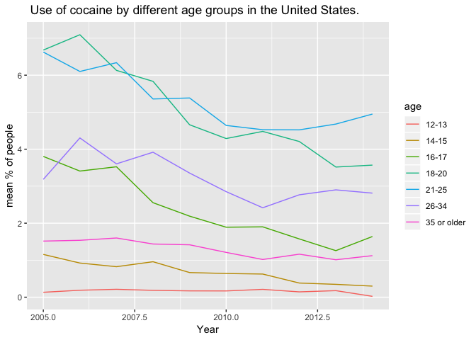

The graph shows that for age groups 16-17, 18-20, 21-25, and 26-34, the use of cocaine has gone down through the years. For the age groups 12-13, 14-15, and 35-older, the use has nearly stayed the same.

``` r
ggplot(drugs_income,aes(year,coke_mean))+
  geom_line(aes(col=income))+labs(title=" Use of cocaine by different income groups in the United States.",x="Year",y="mean % of people")
```

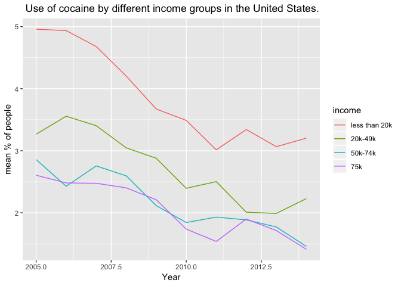

The graph shows that for all income groups, the use of cocaine has gone down through the years.

``` r
ggplot(drugs_education,aes(year,coke_mean))+
  geom_line(aes(col=education))+labs(title=" Use of cocaine by different education groups in the United States.",x="Year",y="mean % of people")
```

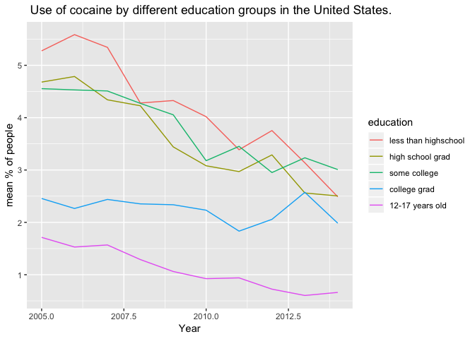

The graph shows that for all education groups, the use of cocaine has gone down through the years.

``` r
ggplot(drugs_sex,aes(year,coke_mean))+
  geom_line(aes(col=sex))+labs(title=" Use of cocaine by sex groups in the United States.",x="Year",y="mean % of people")
```

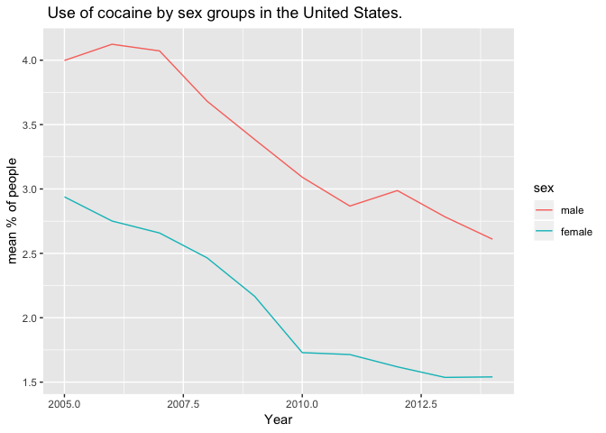

The graph shows that for both genders, the use of cocaine has gone down through the years.

``` r
t.test(COCYR~year, sub05_14, na.rm=TRUE)
```

    ## 
    ##  Welch Two Sample t-test
    ## 
    ## data:  COCYR by year
    ## t = 14.22, df = 105330, p-value < 2.2e-16
    ## alternative hypothesis: true difference in means is not equal to 0
    ## 95 percent confidence interval:
    ##  0.01199843 0.01583463
    ## sample estimates:
    ## mean in group 2005 mean in group 2014 
    ##         0.03441553         0.02049900

Based off of the results of the T test, the mean values between the two years are significantly different. The P value is &lt; .05 and the T value is relatively large, showing that we can reject the null hypothesis. The degrees of freedom is 111,174 since we had 111,176 entries after adding the 2005 and 2014 data together (N1 + N2 -2). The 95% confidence interval does not contain the null hypothesis value, which is 0, showing again that our results are statistically significant.

### Summary of the use of Cocaine

Cocaine use has decreased from 2005 to 2014. Based on visal trends in prevalence use over ten years, it appears the highest percentage of use is consistently occuring among males aged 21-25 --who didn't complete high school--with income less than 20k. However, the trend for use of cocaine for people who did not complete high school has been on a sharp decline since 2012.

Trends in use of heroin in the United States between 2005 and 2014
------------------------------------------------------------------

``` r
ggplot(drugs_age,aes(year,heroin_mean))+
  geom_line(aes(col=age))+labs(title=" Use of heroin by different age groups in the United States.",x="Year",y="mean % of people")
```

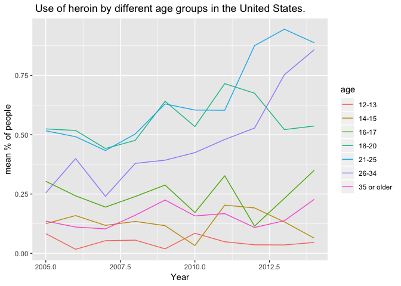

The graph shows that:

-   for age groups 35+ and 12-13, the use of heroin has stayed consistently low.
-   for age groups 21-25 and 26-34, the use of heroin has constantly been increasing.
-   for age groups 14-15, it has consistently stayed low and is on a decline in recent years.
-   for age group 16-17, it has been fluctuating throughout the years
-   for age group 18-20, although stating consistently low, has started to rise in recent years.

``` r
ggplot(drugs_income,aes(year,heroin_mean))+
  geom_line(aes(col=income))+labs(title=" Use of heroin by different income groups in the United States.",x="Year",y="mean % of people")
```

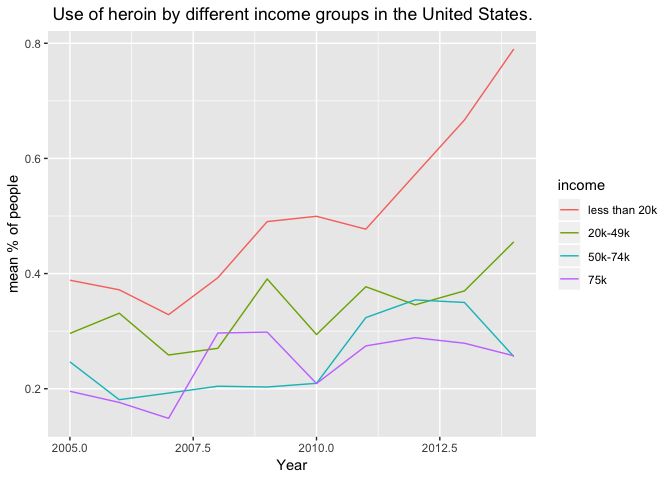

Graph shows sharp rising trend in use of heroin in low income groups.

``` r
ggplot(drugs_education,aes(year,heroin_mean))+
  geom_line(aes(col=education))+labs(title=" Use of heroin by different education groups in the United States.",x="Year",y="mean % of people")
```

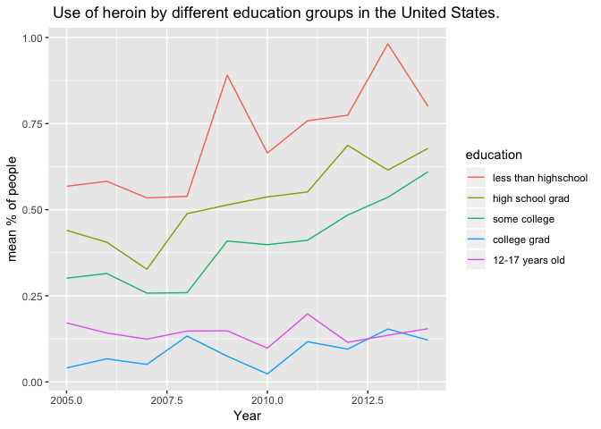

Consistently low use of heroin for college grads and 12-17 year olds. Increasing trend for high school grads and some college grads. fluctuating trend for less than high schoolers.

``` r
ggplot(drugs_sex,aes(year,heroin_mean))+
  geom_line(aes(col=sex))+labs(title=" Use of heroin by sex groups in the United States.",x="Year",y="mean % of people")
```

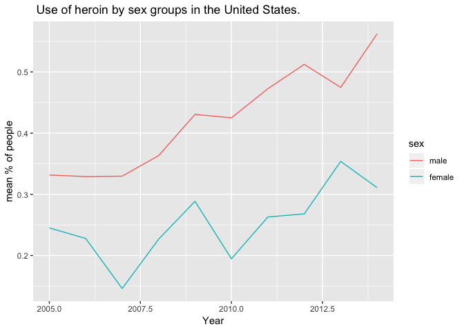

Rising trend of use of heroin for males. Fluctuating for females.

``` r
t.test(HERYR~year, sub05_14, na.rm=TRUE)
```

    ## 
    ##  Welch Two Sample t-test
    ## 
    ## data:  HERYR by year
    ## t = -4.0265, df = 106400, p-value = 5.666e-05
    ## alternative hypothesis: true difference in means is not equal to 0
    ## 95 percent confidence interval:
    ##  -0.002146986 -0.000741129
    ## sample estimates:
    ## mean in group 2005 mean in group 2014 
    ##        0.002861998        0.004306056

Based off of the results of the T test, the means between the two years are significantly different. The P value is &lt; .05 and the T value is a decent amount away from 0, supporting that we can reject the null hypothesis. The degrees of freedom is 111,174 since we had 111,176 entries after adding the 2005 and 2014 data together (N1 + N2 -2). The 95% confidence interval does not contain the null hypothesis value, which is 0, showing again that our results are statistically significant.

### Summary of the use of Heroin

Heroin use has significantly increased from 2005 to 2014. Based on visual trends in prevalence use over ten years, it appears the highest percentage of use is consistently occuring among males age 21-34-- who didn't complete high school-- with income less than 20k. Ther is a rising trend for high school grads and some college education group. While male tend to use heroin more frequently, female use appears to be on a decline since 2013.

Trends in use of oxycotin in the United States between 2005 and 2014
--------------------------------------------------------------------

``` r
ggplot(drugs_age,aes(year,oxycontin_mean))+
  geom_line(aes(col=age))+labs(title=" Use of oxycontin by different age groups in the United States.",x="Year",y="mean % of people")
```

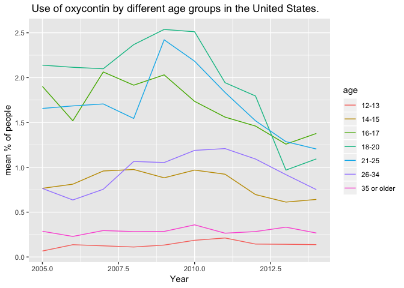

The graph shows that for age groups 16-17, 18-20, and 21-25, the use of oxycontin has gone down through the years. For the age groups 12-13, 14-15, 35-older, and 26-34, the use has nearly stayed the same.

``` r
ggplot(drugs_income,aes(year,oxycontin_mean))+
  geom_line(aes(col=income))+labs(title=" Use of oxycotin by different income groups in the United States.",x="Year",y="mean % of people")
```

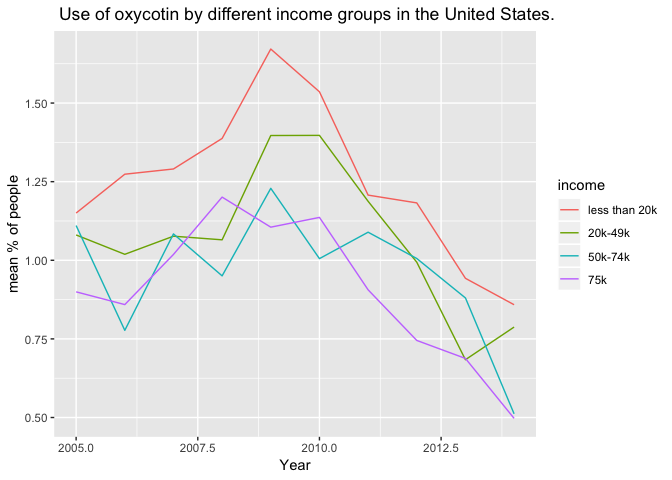

Graph shows sharp declining trends for all income groups since 2008-2009

``` r
ggplot(drugs_education,aes(year,oxycontin_mean))+
  geom_line(aes(col=education))+labs(title=" Use of oxycontin by different education groups in the United States.",x="Year",y="mean % of people")
```

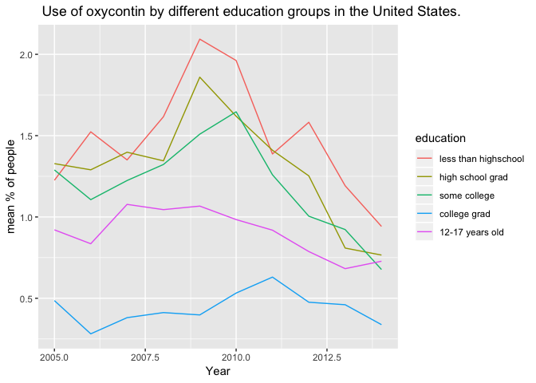

Consistently low use of oxycontin for college grads and 12-17 year olds. decreasing trend for all other education groups, even though there was a rising trend till 2008-2009.

``` r
ggplot(drugs_sex,aes(year,oxycontin_mean))+
  geom_line(aes(col=sex))+labs(title=" Use of oxycontin by sex groups in the United States.",x="Year",y="mean % of people")
```

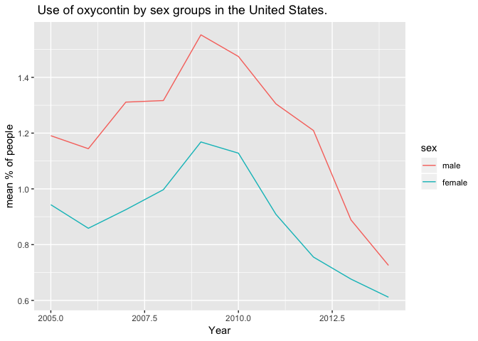

After a sharp rising and peaking at 2008-2009, both genders show a sharp decline in recent years.

``` r
t.test(OXYYR~year, sub05_14, na.rm=TRUE)
```

    ## 
    ##  Welch Two Sample t-test
    ## 
    ## data:  OXYYR by year
    ## t = 7.123, df = 106230, p-value = 1.063e-12
    ## alternative hypothesis: true difference in means is not equal to 0
    ## 95 percent confidence interval:
    ##  0.002862504 0.005035850
    ## sample estimates:
    ## mean in group 2005 mean in group 2014 
    ##        0.010607280        0.006658103

Based off of the results of the T test, the means between the two years are significantly different. The P value is &lt; .05 and the T value is relatively large, showing that we can reject the null hypothesis. The degrees of freedom is 111,174 since we had 111,176 entries after adding the 2005 and 2014 data together (N1 + N2 -2). The 95% confidence interval does not contain the null hypothesis value, which is 0, showing again that our results are statistically significant.

### Summary of the use of Oxycontin

Oxycontin use has significantly decreased from 2005 to 2014. Based on visual trends in prevalence use over ten years, it appears both genders, between the age of 16-25, have dramatically reduced the use of the drug since 2008-2009. In the recent years, although people aged 16-25 still have a relatively higher use, no other category can be singled out as having a higher impact on the use og the drug, since people from all education backgrounds, gender, and income groups, have decreased their frequency use to approximately a similar level.

Trends in use of meth in the United States between 2005 and 2014
----------------------------------------------------------------

``` r
ggplot(drugs_age,aes(year,meth_mean))+
  geom_line(aes(col=age))+labs(title=" Use of meth by different age groups in the United States.",x="Year",y="mean % of people")
```

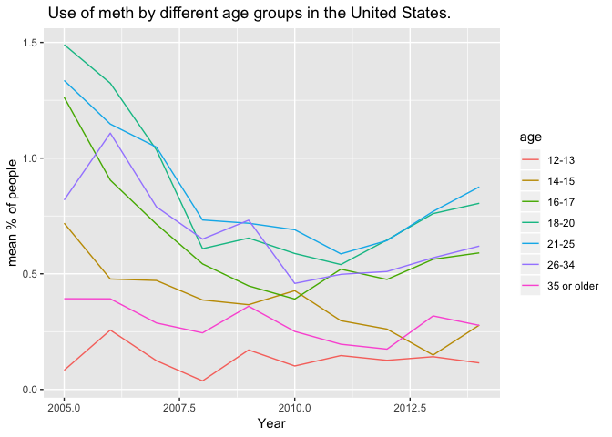

The graph shows that for age groups 16-17, 18-20, 21-25, and 31-34 the use of meth has been on a rise since 2010. For the age groups 12-13 and 35-older, the use has been consistently low.

``` r
ggplot(drugs_income,aes(year,meth_mean))+
  geom_line(aes(col=income))+labs(title=" Use of Meth by different income groups in the United States.",x="Year",y="mean % of people")
```

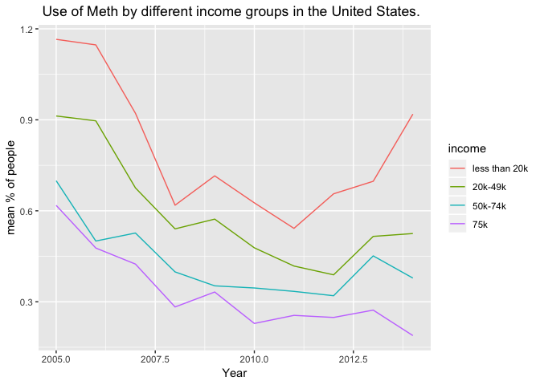

Graph shows sharp increasing trends for income group less tha 20k since 2010, while showing decreasing trends for other income groups.

``` r
ggplot(drugs_education,aes(year,meth_mean))+
  geom_line(aes(col=education))+labs(title=" Use of meth by different education groups in the United States.",x="Year",y="mean % of people")
```

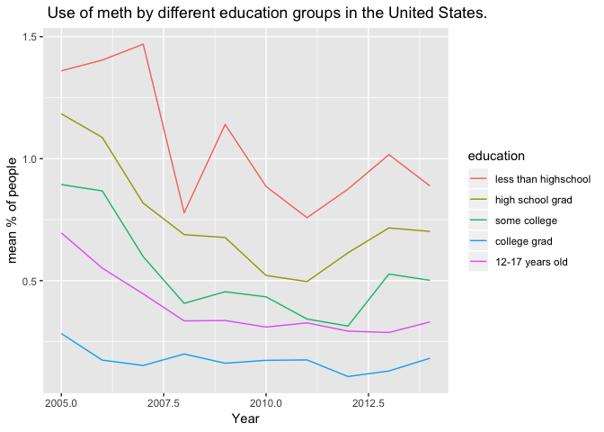

Consistently low use of meth for college grads and 12-17 year olds. decreasing trend for all other education groups, even though there was a rising trend till 2008-2009.

``` r
ggplot(drugs_sex,aes(year,meth_mean))+
  geom_line(aes(col=sex))+labs(title=" Use of meth by sex groups in the United States.",x="Year",y="mean % of people")
```

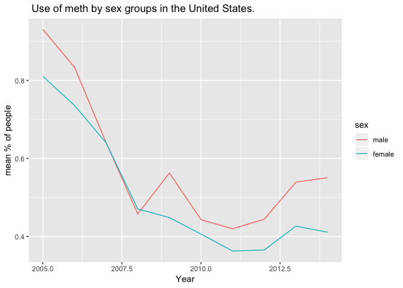

Similar trend for meth use by both genders, with a sharp decline till 2011, but a slighly more increasing trend for males in recent years.

``` r
t.test(MTHYR~year, sub05_14, na.rm=TRUE)
```

    ## 
    ##  Welch Two Sample t-test
    ## 
    ## data:  MTHYR by year
    ## t = 7.9613, df = 103250, p-value = 1.72e-15
    ## alternative hypothesis: true difference in means is not equal to 0
    ## 95 percent confidence interval:
    ##  0.002939081 0.004858852
    ## sample estimates:
    ## mean in group 2005 mean in group 2014 
    ##        0.008675432        0.004776465

Based off of the results of the T test the means between the two years are significantly different. The P value is &lt; .05 and the T value is relatively large, which both support rejecting the null hypothesis. The degrees of freedom is 111,174 since we had 111,176 entries after adding the 2005 and 2014 data together (N1 + N2 -2). The 95% confidence interval does not contain the null hypothesis value, which is 0, showing again that our results are statistically significant.

### Summary of the use of Meth

Meth use is on a rise in the recent years, although it was at a decline till 2010. Based on visual trends in prevalence use over ten years, it appears both genders, for all age groups, had reduced the use of meth till 2010. However, in recent years, males aged 16-34 --for all education groups-- with income less than 20k, have an increasing trend in meth use. It is interesting to not that people with less than high school education do show a small decline between 2013-14, unlike other education groups, and unlike other drug use, for which less than high school students have an increasing trend

Drug of greatest concern
------------------------

The most concerning drug out of the four drugs in this analysis would be Heroin. Most of the other drugs have started to have less use in recent years but Heroin has been on the rise. Heroin has shown a steady and sharp rise among almost all catagories of people. According to the data, men have been using Heroin more than women have, but both have seen sharp increases in use through 2005 to 2014. Heroin use has also spiked recently in 2011 for people who earn less than 20k as their yearly income, and Heroin use also spiked in that year for people ages 21-34. The t-test for heroin showed that the means were significantly different between the years 2005 and 2014, and also showed that the mean percent of people using the drug increased. Throughout the data, Heroin use has been increasing in the recent years and many of the catagories still show an increase in use which makes it the most concerning drug in the analysis.

Executive Summary
-----------------

Throughout the years, the use of all drugs, except Heroin, in all demographics have either remained the same or have declined, either slowly or drastically. High use of drug intake is mostly seen in Males between the ages 18-20 and 21-25, who earn less than 20k, and have less than high school education. Heroin is the only drug that shows a prominent increasing trend throughout the years, even more so in recent years, and we propose NIDA highly focus on this particular drug for prevention efforts. For heroin particularly, we recommend NIDA focus on males aged between 21-34, who earn less than 20k, and have less than high school education, since they show the most drastic increase in heroin use in recent years, not showing any sign of decline.

Interpretation
--------------

The two articles both came to the same conclusion, people started using Heroin instead of prescription pain killers. The articles stated that around 2010 doctors started to be less willing to give out percription pain killers to patients leading to many of them switching to Heroin instead of the pain killers. This complements our statistical findings when you look at the oxycotin graphs and see there was a sharp decline in use of oxycotin in 2010-2012 and a sharp rise in heroin use in those same years.
