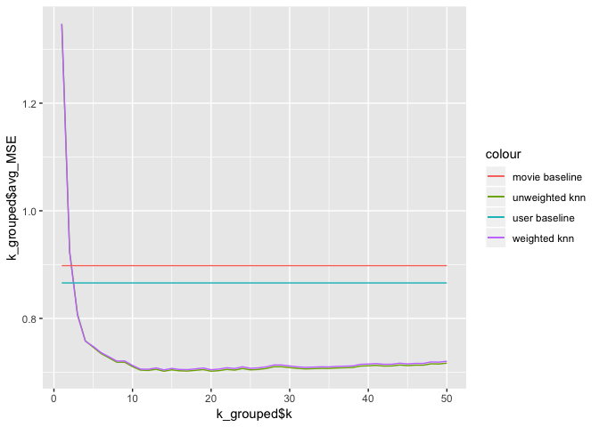

Movie Recommendation: Content Based Approach Analysis
================

1. Read in clean, analyzable data
---------------------------------

``` r
movies = read_csv("movies.csv")
```

    ## Parsed with column specification:
    ## cols(
    ##   movieId = col_integer(),
    ##   title = col_character(),
    ##   genres = col_character()
    ## )

``` r
genomes<-read_csv("MovieGenome.csv")
```

    ## Parsed with column specification:
    ## cols(
    ##   .default = col_double(),
    ##   movieId = col_integer()
    ## )

    ## See spec(...) for full column specifications.

``` r
tags<-read_csv("genome-tags.csv")
```

    ## Parsed with column specification:
    ## cols(
    ##   tagId = col_integer(),
    ##   tag = col_character()
    ## )

``` r
ratings<-read_csv("ratings.csv")
```

    ## Parsed with column specification:
    ## cols(
    ##   userId = col_integer(),
    ##   movieId = col_integer(),
    ##   rating = col_double()
    ## )

2. Perform a PCA
----------------

Perform a PCA on the MovieGenome data. This data is perfect for a PCA: there are over a thousand columns, every row has a variable in every column, many columns are uninformative (What percentage of movies are primarily about Rio de Janeiro??), and there are high correlations between columns (if a movie is ‘silent’, it is almost certainly a ‘no dialog’ movie.) Save the movieId and a number of PCs to capture 90% of the variability in a dataframe.

``` r
genome.pca = prcomp(genomes[,2:1129], scale.=FALSE,center = FALSE)
```

``` r
######
##Plotting proportion of variance explained
pca_var = genome.pca$sdev^2
prop_varex <- pca_var/sum(pca_var) #Proportion of variance

plot(cumsum(prop_varex),type='b') #Cumulative proportion of variance
```


Looking at the graph, I can extrapolate that we are capturing 95% of variability in our data. Hence, we will be using only the first 500 PCA's to speed up our computation without using important information.

``` r
pca_df<-data.frame(movieId=genomes$movieId,genome.pca$x[,1:500])
```

3. Pick a movie to use for prediction
-------------------------------------

I picked my favorite movie and found it’s movieId in the Movies.csv file. This is the movie I will generate predictions for.

The movie I am selecting is: Mr. Nobody

79357: Mr Nobody (2009)

To save on computational effort, compute the data frame of distances between your chosen movie and every other movie you have genome data for.

``` r
distances<-numeric(10381)

pca_dist<-pca_df[,2:500]
```

``` r
pca_df[match(79357,pca_df$movieId),]
```

``` r
myMovieRow<-pca_dist[9100,]


for(i in 1:10381){
  
  df<-data.frame()
  df = rbind(myMovieRow,pca_dist[i,])
  d=dist(df,method="euclidian")
  
  distances[i]=d
}
```

To do a sanity check, we sort the data in ascending order of distance from our chosen movie, and ouput the top 3 (closest movies) and bottom 3 (farthest movies) to see if those movies make sense.

``` r
dist_df<-data.frame(movieId=pca_df$movieId,distances)

dist_df<-dist_df[order(dist_df$distances),]

top3<-dist_df[2:4,]
bottom3<-dist_df[10379:10381,]
```

``` r
movies[match(53464,movies$movieId),]
```

    ## # A tibble: 1 x 3
    ##   movieId title                                       genres               
    ##     <int> <chr>                                       <chr>                
    ## 1   53464 Fantastic Four: Rise of the Silver Surfer … Action|Adventure|Sci…

**Top 3 movies:**

1.  id 48043: Fountain,The (2006)
2.  id 4975: Vanilla Sky (1982)
3.  id 89039: Another Earth (2011)

**Bottom 3 movies:**

1.  id 5254: Blade II (2002)
2.  id 51007: Days of Glory (Indigènes) (2006)
3.  id 53464: Fantastic Four: Rise of the Silver Surfer (2007)

These movies make sense, because my top 3 predictions are all sci-fi,fantasy movies, which is similar to mr. Nobody’s Genre.

The bottom 3, for the most part also make sense because the genre is more action genre

4.Filter Data to estimate performance
-------------------------------------

To reduce the size of the data even more, I reduced the data in the ratings to only users who have rated your chosen movie. Of course in practice we would be using this algorithm for users who have not rated the movie, but using those who have rated the movie here will allow us to estimate the performance of our method and tune the choice of parameters.

Movie id of Mr. Nobody: 79357

``` r
movieRatings<-ratings[which(ratings$movieId==79357),]
myRatingsCsv<-write.csv(movieRatings,"movieRatings.csv")
```

``` r
myRatings<-read.csv("movieRatings.csv")
```

5.Setting baseline parameters to compare model
----------------------------------------------

Anytime you are trying a fancy new algorithm, you always want a simple benchmark you can compare the performance to to see how the algorithm is performing (sometimes it’s the case that the simplest methods can work the best). Therefore, I calculated predictions with two benchmarks: first, predicting each user will rate the movie the global average of that movie’s ratings; and second, predicting each user will rate the movie the average of their own ratings for all movies.

### Global Average

``` r
global_avg_rating<-sum(myRatings$rating)/973
each_userDf<-ratings%>%group_by(userId)%>%summarize(avg_rating=sum(rating)/n())
global_avg_rating
```

    ## [1] 3.824769

### User Average

``` r
myUser_ratings<-data.frame()
for(i in 1:973){
  
  userId = myRatings$userId[i]
  user_movies<-ratings[which(ratings$userId==userId),]
  
  myUser_ratings<-rbind(myUser_ratings,user_movies)
}

myUser_ratings<-myUser_ratings%>%filter(movieId==79357)

each_userDf<-inner_join(myRatings,each_userDf,by="userId")

myUser_ratings<-cbind(myUser_ratings,avg_rating=each_userDf$avg_rating)
```

6.Clustering algorithm to estimate Rating
-----------------------------------------

I Wrote a k-nearest neighbors function that takes as input a sorted list of closest movies and distances and parameter k, and returns the estimated rating. The function is also be able to return simple average or distance-weighted average

``` r
avg_ratings<-ratings%>%group_by(movieId)%>%summarize(rating=sum(rating/n()))

knnDF<-inner_join(dist_df,avg_ratings,by="movieId")

knnDF<-knnDF[2:8474,]
```

### Knn Function

``` r
kEstimate<-function(df,k){
  
  sum_rating<-0
  rating<-numeric(k)
  weights<-df$distances[1:k]
  
  for(i in 1:k){
    
    rate=df$rating[i]
    rating[i] <- rate
    
  }
  avg_rate=mean(rating)
  
  weighted_avg<-weighted.mean(rating,weights)
  
  return(list(avg_rate,weighted_avg))
  
}

kEstimate(knnDF,10)
```

    ## [[1]]
    ## [1] 3.669808
    ## 
    ## [[2]]
    ## [1] 3.677986

7. Loop KNN function over all users
-----------------------------------

Finally, I looped over all users who have seen my chosen movie, and predicted their rating for k = 1, . . . , 50 and for each of the simple and distance weighted versions of knn. This step took me approximately 5 hours of computation time for the full dataset with ~35,000 users

``` r
bigDf<-data.frame()
for(i in 1:973){
  
  df<-data.frame(id=0,r=0,wr=0)
  
  #id<-numeric(i)
  #r<-numeric(i)
  #wr<-numeric(i)
  
  userId=myRatings$userId[i]
  
  user_movies<-ratings[which(ratings$userId==userId),]
  
  estimate_df<-knnDF[,1:2]
  
  user_rating_DF<-inner_join(estimate_df,user_movies,by="movieId")
  
  for(k in 1:50){
    
    rating=kEstimate(user_rating_DF,k)
    
    #id[k] = userId
    #r[k] = rating[1]
    #wr[k] = rating[2]
    
    id = userId
    r = as.numeric(rating[1])
    wr = as.numeric(rating[2])
    
    df<-rbind(df,c(id,r,wr))
    #df=as.data.frame(df)
    
  }
  bigDf<-rbind(bigDf,df)
  
}

bigDf<-bigDf%>%filter(id!=0)
```

``` r
csv<-write.csv(bigDf,"bigDf.csv")
```

``` r
bigDf<-read.csv("bigDf.csv")
bigDf<-bigDf[-c(1)]
```

``` r
kVals<-data.frame()

for(i in 1:50){
  kVals=rbind(kVals,i)
}

k<-data.frame()

for(i in 1:973){
  k<-rbind(k,kVals)
}

colnames(k)<-"k"

bigDf<-cbind(bigDf,k)
```

``` r
users_grouped<-bigDf%>%group_by(id=bigDf$id)%>%summarize(avg_r=mean(r),avg_wt_r=mean(wr))

my_movie_r<-numeric(973)
for(i in 1:973){
  
  user_row<-myRatings[match(users_grouped$id[i],myRatings$userId),]
  user_rating = user_row[,4]
  my_movie_r[i]=user_rating
}

users_grouped<-cbind(users_grouped,my_movie_r)


bigDf<-left_join(bigDf,users_grouped,by="id")

bigDf<-bigDf[-c(5:6)]

bigDf<-bigDf%>%mutate(avg_MSE=(r-my_movie_r)^2,
                                      wt_MSE=(wr-my_movie_r)^2)
```

``` r
k_grouped<-bigDf%>%group_by(k=bigDf$k)%>%summarize(avg_MSE=mean(avg_MSE),wt_MSE=mean(wt_MSE))

#k_grouped<-k_grouped%>%mutate(avg_MSE=(avg_r-my_movie_r)^2,
                                      #wt_MSE=(avg_wt_r-my_movie_r)^2)
```

### user average MSE line

``` r
myUser_ratings<-myUser_ratings%>%mutate(MSE=(avg_rating-rating)^2)

user_MSE<-mean(myUser_ratings$MSE)
```

### global average MSE line

``` r
users_grouped$global_avg<-rep(global_avg_rating,len=973)
users_grouped<-users_grouped%>%mutate(MSE=(global_avg-my_movie_r)^2)

global_MSE<-mean(users_grouped$MSE)
```

Graphical representation of MSE (Mean Squared error) to check accuracy
----------------------------------------------------------------------

``` r
ggplot()+
  geom_line(aes(k_grouped$k,k_grouped$avg_MSE,col="unweighted knn"))+
  geom_line(aes(k_grouped$k,k_grouped$wt_MSE,col="weighted knn"))+
  geom_line(aes(k_grouped$k,global_MSE,col="movie baseline"))+
  geom_line(aes(k_grouped$k,user_MSE,col="user baseline"))
```



Conclusion
----------

### What choice of parameters is best? How good are your predictions? Comment on what the exact value of MSE means in the context of the recommendation problem.

According to the graph, the best k value to use would be k=15, since the MSE value is the lowest at that point. Our predictions from the model seem to be pretty good, since the MSE values at the lowest point are pretty small. The lowest MSE value of 0.7 at k=15 suggests that the model can predict the user's prediction for a test movie as close as +- 0.7 rating value. Hence, if the the user gives a movie a rating of 4.0, our model would have predicted the rating between 3.3 and 4.7.

Since our model can predict a user's rating of a test movie, we can see check for how the user might predict a particular movie, and if the predicted rating is high, then we should suggest it to the user. For a large scale streaming site, there are millions of viewers who watch movies and the data is stored for them. The model can use the data when a new movies has just arrived on netflix, and can calculate the distances from that movie to the closest movies users have seen and provide predictions for it. The more movies the viewers watch, the better the model can be trained and provide better predictions.

### Possible improvements

However, for large scale movie streaming sites, the computation has to be faster, both for the model to run and for the recommender system to suggest. One way we would have improved the run time of our model was using the lapply and sapply function instead of nested for-loops to loop over all the users in our data set. Another way to make recommendations computationally fast is to use multiple servers to run the code, in order to divide the workload, making the calculations faster. We can also subset a viewer's data by genre, and compare new movies by genre to predict ratings, so that less memory is occupied at a time. It will however, give a very specific rating, and thus while it can be more accurate for particular genres, it may not be the case for predicting from one genre to the other. Finally, we can figure out another, better dimensionality reduction method that can further reduce the data than PCA can.
