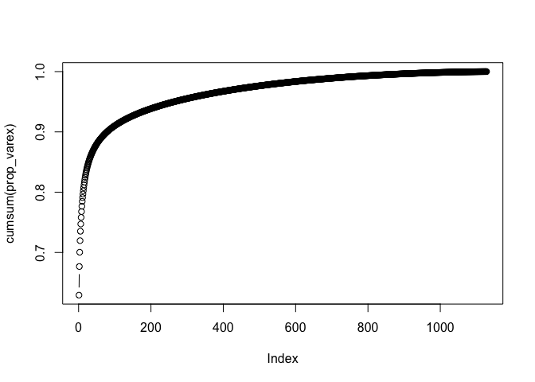
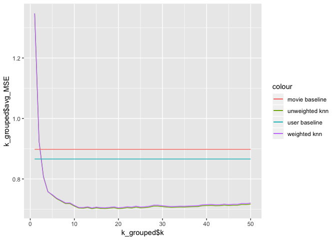

movies
================

Question 1
==========

``` r
movies = read_csv("movies.csv")
```

    ## Parsed with column specification:
    ## cols(
    ##   movieId = col_integer(),
    ##   title = col_character(),
    ##   genres = col_character()
    ## )

``` r
genomes<-read_csv("MovieGenome.csv")
```

    ## Parsed with column specification:
    ## cols(
    ##   .default = col_double(),
    ##   movieId = col_integer()
    ## )

    ## See spec(...) for full column specifications.

``` r
tags<-read_csv("genome-tags.csv")
```

    ## Parsed with column specification:
    ## cols(
    ##   tagId = col_integer(),
    ##   tag = col_character()
    ## )

``` r
ratings<-read_csv("ratings.csv")
```

    ## Parsed with column specification:
    ## cols(
    ##   userId = col_integer(),
    ##   movieId = col_integer(),
    ##   rating = col_double()
    ## )

Question 2
==========

``` r
genome.pca = prcomp(genomes[,2:1129], scale.=FALSE,center = FALSE)
```

``` r
######
##Plotting proportion of variance explained
pca_var = genome.pca$sdev^2
prop_varex <- pca_var/sum(pca_var) #Proportion of variance

plot(cumsum(prop_varex),type='b') #Cumulative proportion of variance
```



``` r
pca_df<-data.frame(movieId=genomes$movieId,genome.pca$x[,1:500])
```

Question 3
==========

79357: Mr Nobody (2009)

``` r
distances<-numeric(10381)

pca_dist<-pca_df[,2:500]


pca_df[match(79357,pca_df$movieId),]
```

    ##      movieId      PC1       PC2         PC3        PC4      PC5      PC6
    ## 9100   79357 -7.48057 0.9237691 -0.09194704 -0.2547788 3.073192 1.228143
    ##            PC7       PC8       PC9     PC10      PC11      PC12      PC13
    ## 9100 -0.227578 -1.514628 -1.465769 0.484271 0.5186834 0.6239513 0.5913129
    ##           PC14        PC15      PC16       PC17      PC18       PC19
    ## 9100 -0.668703 -0.01354494 -0.773772 0.03734069 0.3700473 -0.6123173
    ##             PC20       PC21       PC22      PC23     PC24      PC25
    ## 9100 -0.05194597 -0.2144709 -0.3958468 0.1761756 0.896478 0.6391841
    ##            PC26      PC27        PC28      PC29      PC30     PC31
    ## 9100 -0.3275714 0.2041438 -0.05947758 -0.231234 0.3794635 0.101418
    ##             PC32        PC33      PC34      PC35       PC36      PC37
    ## 9100 -0.02312062 -0.04310233 0.3793917 0.5806429 -0.1676467 0.2209269
    ##           PC38       PC39        PC40       PC41      PC42      PC43
    ## 9100 0.4986361 -0.2335076 -0.02522642 0.08004143 0.2607715 0.2624948
    ##            PC44      PC45       PC46        PC47     PC48      PC49
    ## 9100 -0.1692169 0.1887483 -0.3947739 -0.09431373 0.158289 0.3547496
    ##           PC50       PC51       PC52      PC53       PC54      PC55
    ## 9100 0.1298407 0.08108601 -0.2780618 0.0241936 0.08688542 0.1222236
    ##             PC56       PC57      PC58      PC59         PC60      PC61
    ## 9100 -0.05510122 -0.2218109 0.1193316 0.3044477 -0.006991253 -0.227162
    ##            PC62       PC63      PC64      PC65       PC66      PC67
    ## 9100 -0.2231213 -0.4085678 0.4013196 0.1620217 -0.1453831 -0.019327
    ##            PC68       PC69      PC70      PC71       PC72       PC73
    ## 9100 -0.1957092 -0.1711338 0.2557786 0.3065879 -0.2736104 -0.3056574
    ##            PC74      PC75       PC76       PC77       PC78      PC79
    ## 9100 -0.1655167 0.1488613 -0.3419185 0.06225649 -0.1743149 0.1037234
    ##            PC80        PC81      PC82       PC83        PC84     PC85
    ## 9100 -0.1481207 -0.04486548 0.1617545 0.09007794 -0.03388287 0.130454
    ##             PC86        PC87        PC88       PC89       PC90       PC91
    ## 9100 -0.04938461 -0.07664986 -0.06340841 0.07182664 -0.1104026 0.07296673
    ##          PC92       PC93       PC94      PC95      PC96       PC97
    ## 9100 0.212434 0.06826717 0.03832626 0.1000779 0.3619416 -0.1750869
    ##           PC98       PC99      PC100       PC101    PC102      PC103
    ## 9100 0.3541628 -0.2133693 0.01582643 -0.03984822 0.166347 0.01328328
    ##            PC104     PC105      PC106       PC107     PC108     PC109
    ## 9100 -0.01794936 0.1483406 -0.1244196 -0.06346786 -0.155934 0.2213589
    ##            PC110      PC111      PC112     PC113       PC114     PC115
    ## 9100 -0.05471344 0.02519093 -0.1323472 0.3148747 -0.02198359 0.2274871
    ##           PC116     PC117      PC118       PC119      PC120     PC121
    ## 9100 0.02755606 0.2110516 -0.3956335 -0.08151178 0.08956834 -0.189389
    ##          PC122     PC123      PC124      PC125      PC126      PC127
    ## 9100 0.1755045 0.1420435 0.07592483 0.04471562 0.09570609 -0.1225449
    ##          PC128     PC129       PC130       PC131     PC132      PC133
    ## 9100 -0.220179 0.2293826 0.004139719 -0.01060476 0.2435794 0.04265827
    ##        PC134     PC135     PC136      PC137        PC138      PC139
    ## 9100 0.11131 0.1063459 0.1446633 0.04276765 -0.001807174 0.07619801
    ##            PC140     PC141       PC142      PC143       PC144     PC145
    ## 9100 -0.02234832 0.0205928 -0.01132568 -0.1396078 -0.09074773 0.0129172
    ##            PC146       PC147      PC148       PC149     PC150       PC151
    ## 9100 -0.02264444 -0.06901701 0.07786969 0.007269621 0.1841411 -0.07152652
    ##              PC152       PC153      PC154      PC155      PC156      PC157
    ## 9100 -0.0006468872 -0.01584118 -0.1196041 -0.0132773 0.03552055 0.05079591
    ##            PC158       PC159       PC160       PC161      PC162
    ## 9100 -0.08060468 -0.03278968 -0.07610566 -0.03669873 0.06719582
    ##            PC163     PC164       PC165     PC166      PC167      PC168
    ## 9100 -0.00375565 0.1860055 0.006902271 0.2109184 0.02871609 -0.1629238
    ##          PC169       PC170       PC171         PC172      PC173
    ## 9100 0.1298496 -0.06965618 -0.01904592 -0.0004623711 0.05862611
    ##            PC174       PC175      PC176     PC177      PC178      PC179
    ## 9100 -0.09119079 -0.06637705 -0.1566223 0.1438438 0.04807463 0.09743002
    ##           PC180       PC181      PC182       PC183     PC184       PC185
    ## 9100 0.01334839 -0.05345457 -0.1693967 -0.06787873 0.1663681 0.001612599
    ##            PC186      PC187       PC188    PC189       PC190    PC191
    ## 9100 -0.06531941 -0.1307091 -0.06135597 0.200058 0.003003892 0.179657
    ##            PC192       PC193      PC194      PC195      PC196      PC197
    ## 9100 -0.05838778 0.006014097 0.02424793 0.05081356 -0.1031515 0.05823446
    ##           PC198      PC199      PC200       PC201      PC202        PC203
    ## 9100 0.02857633 0.04472307 0.06101774 -0.06315463 0.03605689 -0.008576074
    ##            PC204    PC205     PC206       PC207     PC208      PC209
    ## 9100 -0.01350535 0.194514 0.1068713 -0.07099243 0.2982506 0.02663264
    ##           PC210      PC211      PC212       PC213      PC214       PC215
    ## 9100 -0.1545953 0.01089849 -0.1166909 -0.04827418 0.06871362 -0.07385239
    ##           PC216      PC217        PC218       PC219     PC220      PC221
    ## 9100 -0.1800187 -0.1231218 0.0006489996 -0.05546561 0.1270988 0.01025693
    ##            PC222      PC223       PC224      PC225      PC226       PC227
    ## 9100 -0.07654241 0.02194366 -0.06062592 -0.1022805 -0.0986219 -0.09019267
    ##           PC228       PC229       PC230       PC231     PC232    PC233
    ## 9100 0.06714801 -0.06763644 -0.06758969 -0.03883323 0.1199731 0.159705
    ##           PC234       PC235       PC236      PC237       PC238      PC239
    ## 9100 0.02165035 -0.09288965 -0.06966703 0.07051123 -0.05732388 -0.2956249
    ##           PC240      PC241      PC242      PC243       PC244      PC245
    ## 9100 0.06322291 0.03684496 0.04881869 -0.1419994 0.001220997 0.06458389
    ##             PC246     PC247      PC248        PC249       PC250      PC251
    ## 9100 -0.003413762 0.0975162 0.01345234 -0.006405415 -0.07335496 0.02947149
    ##            PC252       PC253      PC254       PC255      PC256       PC257
    ## 9100 -0.04198677 -0.05581521 -0.0707257 -0.01919049 0.04663145 -0.05277516
    ##           PC258      PC259      PC260      PC261       PC262       PC263
    ## 9100 -0.0417719 0.03349872 -0.0308974 0.00794676 -0.01128306 -0.01421128
    ##          PC264      PC265      PC266       PC267       PC268      PC269
    ## 9100 0.0588342 0.03751464 -0.1331056 -0.09990503 -0.04548823 0.04393537
    ##           PC270       PC271      PC272       PC273       PC274      PC275
    ## 9100 0.09400732 -0.05821015 0.02916944 -0.04560462 -0.03857492 0.07481951
    ##           PC276       PC277    PC278      PC279      PC280      PC281
    ## 9100 0.06362403 -0.04656201 0.156225 0.01727376 0.02764767 0.07715392
    ##            PC282      PC283      PC284     PC285      PC286       PC287
    ## 9100 -0.05763607 -0.1208694 0.04803094 0.1035347 0.03998823 -0.00650406
    ##         PC288      PC289       PC290     PC291     PC292     PC293
    ## 9100 0.177595 0.06061786 -0.05140623 0.1043851 0.2094169 0.1230799
    ##            PC294      PC295      PC296       PC297       PC298
    ## 9100 -0.02247552 0.03949622 0.02897527 -0.08738181 -0.04284793
    ##             PC299        PC300      PC301       PC302      PC303
    ## 9100 -0.005279845 -0.008258218 0.08236064 -0.08561125 0.05787741
    ##            PC304       PC305       PC306     PC307      PC308       PC309
    ## 9100 -0.02997497 -0.05770567 -0.02862619 -0.035565 0.01273483 -0.05453987
    ##           PC310        PC311      PC312       PC313     PC314        PC315
    ## 9100 0.05333834 -0.005740652 0.08102467 -0.02131936 0.1083136 -0.001064082
    ##            PC316       PC317      PC318      PC319       PC320     PC321
    ## 9100 -0.02984898 -0.01898796 -0.1136133 0.08076664 -0.02662596 0.0543211
    ##          PC322     PC323      PC324      PC325     PC326      PC327
    ## 9100 0.1298452 0.0336237 0.02744558 0.03188999 -0.116177 0.07049394
    ##            PC328       PC329      PC330      PC331        PC332
    ## 9100 -0.07114797 -0.03215312 0.02247541 0.03322731 -0.004843143
    ##            PC333     PC334     PC335       PC336     PC337       PC338
    ## 9100 -0.05767204 0.1836039 0.1000841 -0.08268156 0.1384023 -0.03045299
    ##         PC339     PC340       PC341     PC342       PC343       PC344
    ## 9100 0.128918 0.2174711 -0.03177891 0.0760057 -0.02761288 0.004149376
    ##           PC345      PC346      PC347       PC348      PC349     PC350
    ## 9100 0.06034755 0.03548576 0.02251752 0.006644347 0.02999673 0.1483913
    ##         PC351     PC352       PC353        PC354       PC355      PC356
    ## 9100 0.100776 0.1864258 -0.02506993 -0.001822209 -0.04488398 0.01470749
    ##            PC357      PC358       PC359        PC360     PC361      PC362
    ## 9100 -0.01087614 0.08693638 0.001544812 -0.003571453 0.1146984 -0.0379483
    ##           PC363      PC364       PC365       PC366       PC367      PC368
    ## 9100 0.07750699 -0.1434624 -0.09002557 -0.01201797 -0.01666817 0.03182491
    ##           PC369        PC370      PC371       PC372       PC373      PC374
    ## 9100 0.03407535 -0.003698823 0.08975592 -0.06927129 -0.06094848 0.08660537
    ##           PC375       PC376      PC377       PC378       PC379      PC380
    ## 9100 0.06533419 -0.04027459 0.01158685 -0.07619222 -0.02092447 0.03523635
    ##           PC381        PC382      PC383      PC384       PC385      PC386
    ## 9100 0.06663327 -0.006940811 0.04299316 0.04870606 0.007704342 0.04434099
    ##           PC387      PC388      PC389       PC390       PC391       PC392
    ## 9100 0.01875146 0.03249136 -0.1076553 -0.07996359 -0.02793624 -0.09693303
    ##          PC393       PC394     PC395      PC396      PC397     PC398
    ## 9100 0.1587384 -0.05595242 0.1573745 -0.0323382 0.01662292 0.1574077
    ##             PC399     PC400      PC401      PC402      PC403       PC404
    ## 9100 -0.001749447 0.0261632 0.09469543 0.05357682 0.02114776 -0.05274996
    ##            PC405       PC406     PC407      PC408       PC409       PC410
    ## 9100 -0.07724814 -0.01687504 0.1196578 0.03865103 -0.01873408 -0.03825135
    ##            PC411      PC412       PC413       PC414       PC415      PC416
    ## 9100 -0.01750847 -0.1046095 -0.01672872 -0.07486333 -0.01590389 -0.1404931
    ##             PC417      PC418      PC419       PC420       PC421      PC422
    ## 9100 -0.008004677 -0.1949196 0.04277186 -0.01118513 -0.08223497 0.08250025
    ##           PC423      PC424       PC425      PC426       PC427      PC428
    ## 9100 -0.0583886 0.05573801 -0.06337923 0.09923979 -0.05040248 -0.0103062
    ##            PC429      PC430      PC431       PC432       PC433       PC434
    ## 9100 -0.05327016 0.07294006 0.02445338 0.002088322 -0.01878735 -0.01626847
    ##           PC435      PC436      PC437       PC438      PC439       PC440
    ## 9100 0.02761883 0.03647714 0.01225299 -0.01606319 0.02566471 -0.03948388
    ##            PC441       PC442       PC443      PC444      PC445       PC446
    ## 9100 -0.09424659 -0.01804154 -0.01589958 0.01033643 0.04000185 -0.07542453
    ##            PC447       PC448       PC449      PC450      PC451      PC452
    ## 9100 -0.03324357 -0.04604341 0.008605908 -0.0405095 0.02505951 0.07781512
    ##           PC453      PC454       PC455      PC456    PC457      PC458
    ## 9100 0.01399781 -0.1255746 -0.08602315 0.04721768 0.100739 0.03241125
    ##            PC459     PC460      PC461      PC462     PC463       PC464
    ## 9100 -0.06743408 0.0565291 -0.1121359 -0.1131487 0.0502955 -0.06094771
    ##             PC465      PC466      PC467      PC468      PC469    PC470
    ## 9100 -0.005349739 0.07045044 0.05065338 0.06357443 0.00143538 0.103836
    ##            PC471       PC472       PC473      PC474      PC475      PC476
    ## 9100 -0.01888346 -0.01380337 -0.00686777 0.07296998 0.02378968 -0.0756978
    ##           PC477      PC478       PC479        PC480     PC481      PC482
    ## 9100 0.06412441 0.01300906 -0.06732902 0.0001433485 0.0299541 -0.0638141
    ##          PC483     PC484      PC485     PC486     PC487      PC488   PC489
    ## 9100 0.0919622 0.1103809 0.05370666 0.0528119 0.0627212 0.01797723 0.02897
    ##           PC490      PC491      PC492    PC493     PC494      PC495
    ## 9100 0.02103418 0.09213941 0.04459702 0.125039 0.0812442 -0.1273257
    ##           PC496       PC497       PC498       PC499       PC500
    ## 9100 0.06245212 -0.05037212 -0.05252858 -0.04458771 -0.06981981

``` r
myMovieRow<-pca_dist[9100,]


for(i in 1:10381){
  
  df<-data.frame()
  df = rbind(myMovieRow,pca_dist[i,])
  d=dist(df,method="euclidian")
  
  distances[i]=d
}
```

``` r
dist_df<-data.frame(movieId=pca_df$movieId,distances)

dist_df<-dist_df[order(dist_df$distances),]

top3<-dist_df[2:4,]
bottom3<-dist_df[10379:10381,]
```

``` r
movies[match(53464,movies$movieId),]
```

    ## # A tibble: 1 x 3
    ##   movieId title                                       genres               
    ##     <int> <chr>                                       <chr>                
    ## 1   53464 Fantastic Four: Rise of the Silver Surfer … Action|Adventure|Sci…

Top 3 movies:

1.  id 48043: Fountain,The (2006)
2.  id 4975: Vanilla Sky (1982)
3.  id 89039: Another Earth (2011)

Bottom 3 movies:

1.  id 5254: Blade II (2002)
2.  id 51007: Days of Glory (Indigènes) (2006)
3.  id 53464: Fantastic Four: Rise of the Silver Surfer (2007)

Question 4
==========

Movie id of Mr. Nobody: 79357

``` r
movieRatings<-ratings[which(ratings$movieId==79357),]
myRatingsCsv<-write.csv(movieRatings,"movieRatings.csv")
```

``` r
myRatings<-read.csv("movieRatings.csv")
```

Question 5
==========

Global Average

``` r
global_avg_rating<-sum(myRatings$rating)/973
each_userDf<-ratings%>%group_by(userId)%>%summarize(avg_rating=sum(rating)/n())
global_avg_rating
```

    ## [1] 3.824769

User Average

``` r
myUser_ratings<-data.frame()
for(i in 1:973){
  
  userId = myRatings$userId[i]
  user_movies<-ratings[which(ratings$userId==userId),]
  
  myUser_ratings<-rbind(myUser_ratings,user_movies)
}

myUser_ratings<-myUser_ratings%>%filter(movieId==79357)

each_userDf<-inner_join(myRatings,each_userDf,by="userId")

myUser_ratings<-cbind(myUser_ratings,avg_rating=each_userDf$avg_rating)
```

Question 6
==========

``` r
avg_ratings<-ratings%>%group_by(movieId)%>%summarize(rating=sum(rating/n()))

knnDF<-inner_join(dist_df,avg_ratings,by="movieId")

knnDF<-knnDF[2:8474,]
```

Knn Function

``` r
kEstimate<-function(df,k){
  
  sum_rating<-0
  rating<-numeric(k)
  weights<-df$distances[1:k]
  
  for(i in 1:k){
    
    rate=df$rating[i]
    rating[i] <- rate
    
  }
  avg_rate=mean(rating)
  
  weighted_avg<-weighted.mean(rating,weights)
  
  return(list(avg_rate,weighted_avg))
  
}

kEstimate(knnDF,10)
```

    ## [[1]]
    ## [1] 3.669808
    ## 
    ## [[2]]
    ## [1] 3.677986

Question 7
==========

``` r
bigDf<-data.frame()
for(i in 1:973){
  
  df<-data.frame(id=0,r=0,wr=0)
  
  #id<-numeric(i)
  #r<-numeric(i)
  #wr<-numeric(i)
  
  userId=myRatings$userId[i]
  
  user_movies<-ratings[which(ratings$userId==userId),]
  
  estimate_df<-knnDF[,1:2]
  
  user_rating_DF<-inner_join(estimate_df,user_movies,by="movieId")
  
  for(k in 1:50){
    
    rating=kEstimate(user_rating_DF,k)
    
    #id[k] = userId
    #r[k] = rating[1]
    #wr[k] = rating[2]
    
    id = userId
    r = as.numeric(rating[1])
    wr = as.numeric(rating[2])
    
    df<-rbind(df,c(id,r,wr))
    #df=as.data.frame(df)
    
  }
  bigDf<-rbind(bigDf,df)
  
}

bigDf<-bigDf%>%filter(id!=0)
```

``` r
csv<-write.csv(bigDf,"bigDf.csv")
```

``` r
bigDf<-read.csv("bigDf.csv")
bigDf<-bigDf[-c(1)]
```

``` r
kVals<-data.frame()

for(i in 1:50){
  kVals=rbind(kVals,i)
}

k<-data.frame()

for(i in 1:973){
  k<-rbind(k,kVals)
}

colnames(k)<-"k"

bigDf<-cbind(bigDf,k)
```

Question 8
==========

``` r
users_grouped<-bigDf%>%group_by(id=bigDf$id)%>%summarize(avg_r=mean(r),avg_wt_r=mean(wr))

my_movie_r<-numeric(973)
for(i in 1:973){
  
  user_row<-myRatings[match(users_grouped$id[i],myRatings$userId),]
  user_rating = user_row[,4]
  my_movie_r[i]=user_rating
}

users_grouped<-cbind(users_grouped,my_movie_r)


bigDf<-left_join(bigDf,users_grouped,by="id")

bigDf<-bigDf[-c(5:6)]

bigDf<-bigDf%>%mutate(avg_MSE=(r-my_movie_r)^2,
                                      wt_MSE=(wr-my_movie_r)^2)
```

``` r
k_grouped<-bigDf%>%group_by(k=bigDf$k)%>%summarize(avg_MSE=mean(avg_MSE),wt_MSE=mean(wt_MSE))

#k_grouped<-k_grouped%>%mutate(avg_MSE=(avg_r-my_movie_r)^2,
                                      #wt_MSE=(avg_wt_r-my_movie_r)^2)
```

user average MSE line

``` r
myUser_ratings<-myUser_ratings%>%mutate(MSE=(avg_rating-rating)^2)

user_MSE<-mean(myUser_ratings$MSE)
```

global average MSE line

``` r
users_grouped$global_avg<-rep(global_avg_rating,len=973)
users_grouped<-users_grouped%>%mutate(MSE=(global_avg-my_movie_r)^2)

global_MSE<-mean(users_grouped$MSE)
```

``` r
ggplot()+
  geom_line(aes(k_grouped$k,k_grouped$avg_MSE,col="unweighted knn"))+
  geom_line(aes(k_grouped$k,k_grouped$wt_MSE,col="weighted knn"))+
  geom_line(aes(k_grouped$k,global_MSE,col="movie baseline"))+
  geom_line(aes(k_grouped$k,user_MSE,col="user baseline"))
```



According to the graph, the best k value to use would be k=15, since the MSE value is the lowest at that point. Our predictions from the model seem to be pretty good, since the MSE values at the lowest point are pretty small. The lowest MSE value of 0.7 at k=15 suggests that the model can predict the user's prediction for a test movie as close as +- 0.7 rating value. Hence, if the the user gives a movie a rating of 4.0, our model would have predicted the rating between 3.3 and 4.7.

Question 9
==========

Since our model can predict a user's rating of a test movie, we can see check for how the user might predict a particular movie, and if the predicted rating is high, then we should suggest it to the user. For a large scale streaming site, there are millions of viewers who watch movies and the data is stored for them. The model can use the data when a new movies has just arrived on netflix, and can calculate the distances from that movie to the closest movies users have seen and provide predictions for it. The more movies the viewers watch, the better the model can be trained and provide better predictions.

However, for large scale movie streaming sited, the computation has to be faster, both for the model to run and for the recommender system to suggest. One way we would have improved the run time of our model was using the lapply and sapply function instead of nested for-loops to loop over all the users in our data set. Another way to make recommendations computationally fast is to use multiple servers to run the code, in order to divide the workload, making the calculations faster. We can also subset a viewer's data by genre, and compare new movies by genre to predict ratings, so that less memory is occupied at a time. It will however, give a very specific rating, and thus while it can be more accurate for particular genres, it may not be the case for predicting from one genre to the other. Finally, we can figure out another, better dimensionality reduction method that can further reduce the data than PCA can.
