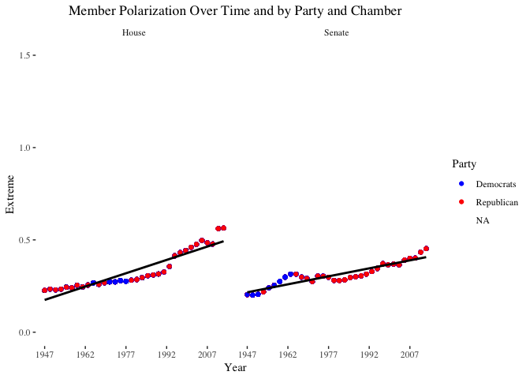
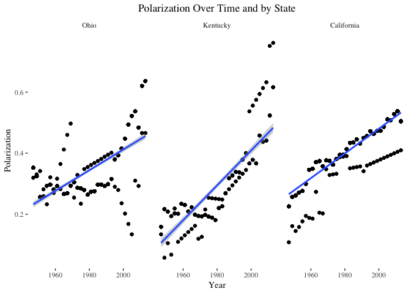
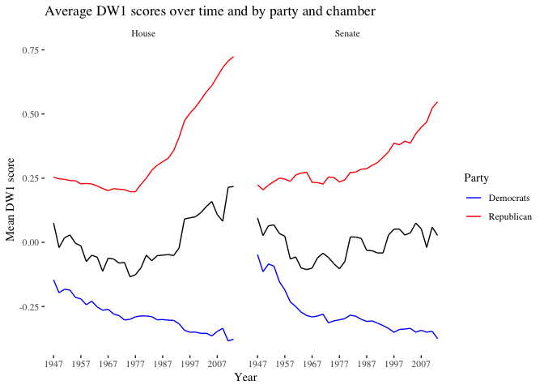
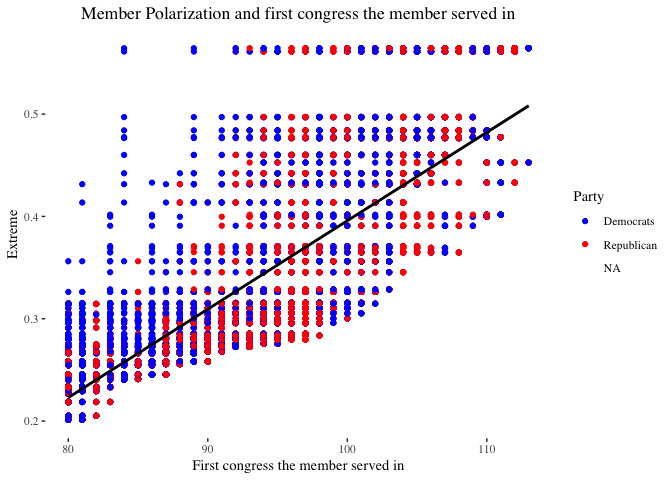
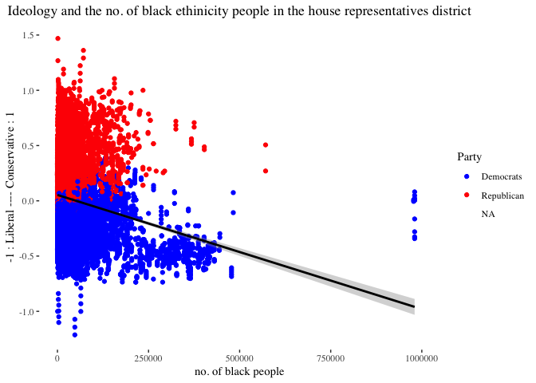
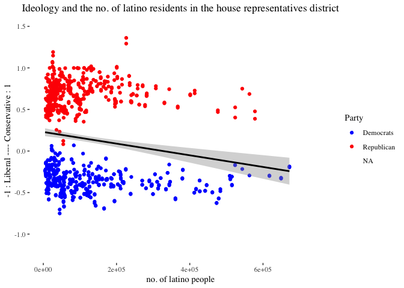

Polarization in congress: Assumptions vs Analysis
================
Danish Siddiquie,Yuchen Hua, Freddie Ortiz
10/25/2017

Introduction
------------

Taking into account multiple demographics, we generally tried to find a correlation among different demographics and their congressional tendencies on: the political spectrum of conservatism and liberalism and party affiliation. Before conducting our data analysis we had educated assumptions in how trends could be explained by certain causes. We will therefore investigate causes, that might cause these trends, in: black and latino community, unemployment, farmers, local worker, rural, urban, finance workers, foreign born, bills introduced and bills passed in the senate, and the time period congressmen were introduced in congress. We believe there to be a strong correlation and causation in liberals usually associated with: blacks, latinos, unemployment, urban, foreign born. We believe there should be a strong correlation and causation in conversatives, which are usually associated with: farmers, local worker, rural, and finance workers.

Trends
------

### Overall Member Polarization

These graphs show that polarization has slightly increased more in the House than in the Senate from 1947 to 2013. This could be due to the fact that since House members represent smaller districts and not just the entire state, they may have more strong personal feelings about how certain solutions and legislation will benefit or harm their districts, leading them to be more stubborn and polarized in their voting patterns. Also, although not represented by a fitted line, it is fairly obvious to see that although Republicans have increased in polarization more so than Democrats in both Chambers of Congress, they have increased to a higher maximum in the House than in the Senate. This could tie in with the inference about House members having strong emotional ties to their voting patterns.

### Analyzing change in polarization for different states

When examining the trends in polarization over the given period of time, we thought that polarization might have changed and developed differently in different states. We thought it could provide important insight to examine how polarization has changed within three states: Kentucky, a traditionally Red state, California, a traditionally Blue state, and Ohio, a swing state.

Based on the visualizations, we can see that polarizations in all countries has increased throughout the years. Moreover, we can see that the polarization in Kentucky has significantly increased throughout the years. We can also see that the overall trend is that the polarization is approximately equal in recent years for all the aforementioned states, irrespective of their assumed ideologies. We would further look as to what could possibly cause such changes in the polarization in recent years.

### Linear models for polarization by state

|             |    Estimate|  Std. Error|    t value|  Pr(&gt;|t|)|
|-------------|-----------:|-----------:|----------:|------------:|
| (Intercept) |  -8.0296272|   0.2259921|  -35.53057|            0|
| year        |   0.0042213|   0.0001142|   36.95102|            0|

|             |    Estimate|  Std. Error|    t value|  Pr(&gt;|t|)|
|-------------|-----------:|-----------:|----------:|------------:|
| (Intercept) |  -9.7891610|   0.1080786|  -90.57449|            0|
| year        |   0.0051109|   0.0000545|   93.83237|            0|

|             |    Estimate|  Std. Error|    t value|  Pr(&gt;|t|)|
|-------------|-----------:|-----------:|----------:|------------:|
| (Intercept) |  -8.5450713|   0.1410458|  -60.58364|            0|
| year        |   0.0044823|   0.0000713|   62.86700|            0|

As we can see, there is a positive slope for polarization in all the states, which means that throughout the years, polarization has increased. The r-squared value was in the 0.8 region for all states, which means that 80% of the variablity in polarization is explained by these states, which is a strong enough value due dig deeper as to what is causing this polarization in these ideologically different states.

Overall ideologies of parties in different chambers
---------------------------------------------------

The black line represents the average polarization of the chamber and congress. The red and blue line are almost mirror images of each other. The black line always remains between the red and the blue lines. This graph starts with the polarization between the two parties after Reconstruction, and goes on to become even more polarozed than before in todays day and age. The average polarization of all members of congress tends to lean towards the Republicans(red line) more.

Causes
------

### polarization due to the first congress the member served in

Analysing the affect of 'first congress member served in' on the polarization in time.
--------------------------------------------------------------------------------------

|             |    Estimate|  Std. Error|    t value|  Pr(&gt;|t|)|
|-------------|-----------:|-----------:|----------:|------------:|
| (Intercept) |  -0.4682599|   0.0035831|  -130.6848|            0|
| firstcong   |   0.0086404|   0.0000386|   223.8604|            0|

the p-value is less than 2e-16, which is statistically significant. The slope for the first congress is 0.0086404. Also, the statistical significance of the linear model is further supported by relatively high adjusted r-squared value of 0.7312, which means that the 73% of variablility in polarization is explained by this variable. The positive slope depicts that the members introduced recently in the congress are more polar than the members introduced in the former years. This is because the political division in America is deeper now than ever before. This is because Americans are increasingly segregating themselves politically, becoming more and more likely to live around others who share their political views. This has resulted in the development of significatly polar ideologies in different communities, depending on who one choosed to affiliate themselves with. In 1976 and before, However, less than a quarter of Americans lived in “landslide” counties—those that voted overwhelmingly for one candidate or another in the presidential election.

Analysing the effect of minoroties \[black and latino community\] on the Polarization
-------------------------------------------------------------------------------------

### linear model of dw1 score vs black and latino under house representatives

|             |    Estimate|  Std. Error|    t value|  Pr(&gt;|t|)|
|-------------|-----------:|-----------:|----------:|------------:|
| (Intercept) |   0.3797405|   0.0296305|  12.815874|            0|
| black       |  -0.0000016|   0.0000002|  -8.491824|            0|
| latino      |  -0.0000008|   0.0000001|  -5.869126|            0|

Assumptions in the latino and black community,under the house representatives \[since house representatives deal more with the community related problems than the senate\], are that they will lean more towards the liberal side because of a stronger affiliation to the democratic party. If there is an extremity preferences(one will lean more towards being liberal or conservative) in these demographics, we will expect to see that they have a tendency to lean more towards the liberal side. However, our data indicates that that yes they have a tendency to lean towards the liberal side, but our statistical tests suggest that it isn’t strong enough evidence to presume that they will do it often. The R-squared value(.1161) of these demographics signify that we can only explain 11.61% of polarization that constitute from latinos and blacks. This makes sense because they communities are only moniroties and thus won't be able to explain a majority of the variation in polarization. The p-value was statistically significant in both demographics. It was more so in the black community than the latino community with a 2e-16 than a 6.2e-9. As well as the steepness of each of their slopes, when it was compared to the polarization. The black community had a steeper negative slope(-1.564e-06) than the latino community(-8.191e-07). This is to be expected because a negative slope just signifies that over the population it will generally lean more towards the liberal side of the spectrum. A possibility in why the black community has a steeper slope could be justified in the idea that latinos are more thought of natural converservatives. This is mainly because a large population of latinos are made up of catholics. Catholics share similar principles with the ideology of conservatism. However, Latinos feel stronger about immigration reform which is most ideally associated with the ideology of liberalism. Looking at the trends of ideology, over time we noticed that in recent years congress was becoming more polarized. Ideology is the backbone of polarization. Therefore, it is an accurate description to state that blacks and latinos will make a (small)difference in polarization.

Analyzing the effect of urban-related variables in California, on the polarization
----------------------------------------------------------------------------------

### Linear model for polarization vs variables

|             |    Estimate|  Std. Error|    t value|  Pr(&gt;|t|)|
|-------------|-----------:|-----------:|----------:|------------:|
| (Intercept) |   0.2489578|   0.0043227|  57.593445|            0|
| finance     |   0.0000026|   0.0000002|  10.722091|            0|
| forborn     |   0.0000007|   0.0000000|  19.623214|            0|
| city        |  -0.0281498|   0.0038533|  -7.305383|            0|

### Linear model for dw1 scores vs variables

|             |    Estimate|  Std. Error|    t value|  Pr(&gt;|t|)|
|-------------|-----------:|-----------:|----------:|------------:|
| (Intercept) |  -0.0643067|   0.0147027|  -4.373813|    0.0000136|
| finance     |   0.0000002|   0.0000002|   1.325760|    0.1852483|
| forborn     |  -0.0000001|   0.0000000|  -2.523500|    0.0117867|

We previously saw that the trend in the polarization for different states had increased in recent times. to investigate why this would be the case, we looked at the demographic variables such as: 1. no. of finance workers 2. no. of foreign born people 3. presence of major city as defined by cencus

We only looked at the state of california to see how these variables have affected polarization. California,a traditionally blue state in recent years, is assumingly significantly liberal, therefore polar.California is also a big city with more highly skilled workers such as people in finance and technology, and people from more diverse ehtnicities reside in the state. Therefore, picking these variables made sense to us.

The linear model for polarization shows that our statistically significant data \[p-value&lt;&lt;0.1\] has a small yet positive intercept for finance workers and foreign born people. This indicates that the the higher the no. of finance workers and foreign born people, the higher the polarization. This makes sense because foreign born people prefer to be more liberal\[as reflected by the negative slope in the dw1 to foreign born linear model\], and support the democratic party, due to republicans being more strict in inclusion. On the other hand, finance workers tend to be more conservative\[as reflected by positive slope in the dw1 to finance linear model\]. We were not able to find a reasonable reason for that. The overall data has strong evidence to polarization, since 44% of the variability in polarization is explained by these variables. Overall however, this results in the overall state of California to become more polar in recent years.

Analyzing the effect of rural-related varibales in Kentucky, on the polarization
--------------------------------------------------------------------------------

### Linear model for polarization vs variables

|             |    Estimate|  Std. Error|    t value|  Pr(&gt;|t|)|
|-------------|-----------:|-----------:|----------:|------------:|
| (Intercept) |   0.3389027|   0.0060046|  56.440209|    0.0000000|
| farmer      |   0.0000010|   0.0000004|   2.788454|    0.0059733|
| rurlfarm    |  -0.0000003|   0.0000001|  -3.742091|    0.0002582|
| unemplyd    |   0.0000001|   0.0000000|   3.741903|    0.0002584|
| loclwrkr    |  -0.0000002|   0.0000001|  -1.412637|    0.1598068|

### Linear model for dw1 scores vs variables

|                |       Estimate|    Std. Error|       t value|                                   Pr(&gt;|t|)|
|----------------|--------------:|-------------:|-------------:|---------------------------------------------:|
| (Intercept)    |      0.0877252|     0.0354421|      2.475171|                                     0.0144152|
| farmer         |      0.0000054|     0.0000021|      2.526858|                                     0.0125315|
| rurlfarm       |     -0.0000012|     0.0000005|     -2.591069|                                     0.0104996|
| unemplyd       |      0.0000009|     0.0000002|      5.243948|                                     0.0000005|
| loclwrkr       |     -0.0000022|     0.0000008|     -2.599156|                                     0.0102659|
| For Kentucky,  |  who we assume|  to be a trad|  itonally red|  state, we looked at the following variables:|
| 1. no. of farm |            ers|              |              |                                              |
| 2. rural farm  |      residents|              |              |                                              |
| 3. unemployed  |      residents|              |              |                                              |
| 4. local gover |  nments worker|             s|              |                                              |

We chose these variables as Kentucky is one of the states who are usually rated as having the poorest education amongst the population. The linear model for polarization shows that our statistically significant data \[p&lt;&lt;0.1\] has a small yet positive slope for farmers and unemployed people \[more polarized\], while has a negative slope for rural farmer residents and local government workers \[less polarized\]. The dw1 scores show that farmers and unemployed people are more conservative \[positive slope fr dw1 scores\] and rural farmers and local govt. workers are more liberal \[negative dw1 slope\].

Combining both the data, we can infer that conservatives are becoming more polar and liberal are becoming less polar in recent times. This also corroborates our graph for avg. dw1 score over time of democrats and republicans, which showed that over time, conservatives have become more polar \[as seen by the steep slope of republican line in the graph.\] Although our hypothesis was that the all less educated might tend more towards conservatism, that was not the case, since rural farmer residents had a negative dw1 slope, which means they were tending more towards the liberal side. Moreover, only 18% of the variability in polarization in the state is explained by these variables, which measn that this is not the main root of why the polarization is high in the state in recent years.

Analyzing the effect of laws passed and bills introduced in the senate, on the polarization
-------------------------------------------------------------------------------------------

### linear model of polarization vs laws passed by senate + bills introduced in senate

|             |    Estimate|  Std. Error|      t value|  Pr(&gt;|t|)|
|-------------|-----------:|-----------:|------------:|------------:|
| (Intercept) |   0.5336642|   0.0028170|   189.446086|     0.00e+00|
| s\_pls      |  -0.0010286|   0.0000056|  -183.294362|     0.00e+00|
| s\_intro    |   0.0000030|   0.0000007|     4.312192|     1.62e-05|

We finally looked into how polarization could be affected by members in the senate. The senate deals with more long term problems, thus the variables 'bills introduced' and 'laws passed' made sense. Looking at the statistically significant data \[p&lt;&lt;0.1\], these variables have a huge effect on the polarization, since appriximately 70% of the variability in polarization is explained by these variables. The bills introduced variable has a small positive slope, which means that the more bills introduced, the more polar the congress is. This makes sense, as more bills would only be introduced if their were significant difference in ideologies between members of the senate. On the other hand, the more laws that are passed, the lesser the polarization is \[as inferred by the negative slope\]. This also makes sense, since more laws would only be able to pass if there was consencus in the congress, which would mean that members would have similar ideologies.

Conclusion
----------

In Conclusion, we were able to clear a lot of assumptions that we had about the causes of polarization, mainly from what we hear from the media. For instance, we did hypothesise that the black and latino community would have a strong inclination towards the liberal side \[which they partially did\]. However, we also thought \[due to media influence\] that that would explain a majority of the variability in the polarization and dw1, which did not turn out to be true. This is because even though the communities do favour the liberal side, the community is not large enough to explain a significant amount of variability. We als were able to sweep away the assumption that most educated people would choose to be liberal \[ False, since finance workers were more conservative\] and less educated would choose conservative \[ False, becasue rural farmers were more liberal\]. The limitation in the project would be an ample amount of missing data which could have an effect on the overall analysis. One thing I would suggest to overcome this issue would be to figure out why the data was missing \[missing at random, missing not at random, missing completely at random\], and use those inferences to get a better model. Overall, we believe that interpreting polarization is more than just quantitative analysis, and the history, expert analysis, and logical explanation also helps us get to the right answers.
